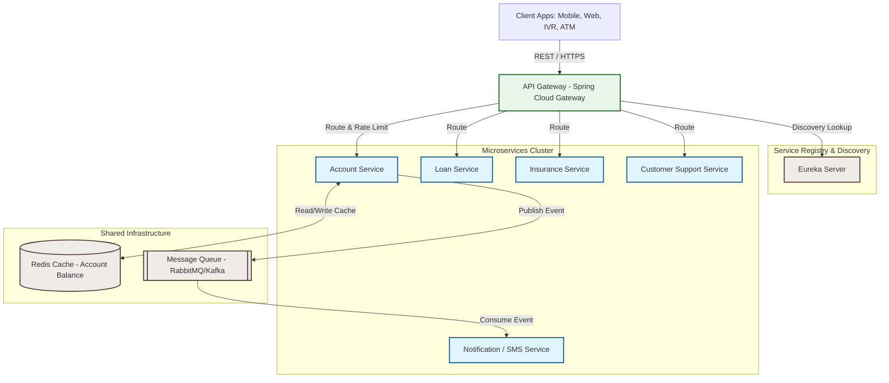

# Microservices Composite Hands-On

This document contains the analysis, research, and technical designs for the hands-on exercises on Enterprise Application structures, Monolithic architecture pain points, and transition strategies to resilient Microservices.

---

## 1. Enterprise Application Theory

### Concept Overview
An **Enterprise Application** is a large-scale, complex software system designed to support and manage the operational processes, information flows, reporting, and data analysis of a large organization (such as a bank, telecom carrier, or healthcare provider). 

Key characteristics of Enterprise Applications include:
*   **High Scalability**: Must handle millions of users and high transaction throughput.
*   **High Availability & Fault Tolerance**: Must remain operational $24/7/365$; downtime results in direct financial and reputational losses.
*   **Multi-Channel Support**: Accessed by diverse actors (customers, support staff, external systems) via diverse channels (mobile apps, web portals, IVR, ATMs, APIs).
*   **Robust Security**: Requires strict identity management, encryption, and compliance auditing.
*   **Integration Complexity**: Integrates with legacy databases, mainframes, third-party payment gateways, and external APIs.

---

### Activity 1: Airtel Products and Services Classification
*Objective: Visit [Airtel](https://www.airtel.in/) and identify/classify the products and services offered.*

Airtel is a leading global telecommunications company with a highly diversified service catalog. Below is the structured classification of Airtel’s current product and service offerings:

| Category | Product / Service Name | Description |
| :--- | :--- | :--- |
| **Consumer Services (B2C Mobile)** | Prepaid Mobile | Voice and high-speed data recharges, including special 5G bundles. |
| | Postpaid Mobile | Monthly billed connections, data rollover options, and family sharing plans. |
| | International Roaming | Customized voice/data packs for global travel. |
| **Home & Entertainment** | Airtel Xstream Fiber | High-speed fiber broadband (up to 1 Gbps) with bundled Wi-Fi routers. |
| | Airtel Digital TV (DTH) | Direct-To-Home satellite television with HD channels and interactive services. |
| | Airtel Xstream Play | Aggregated Over-The-Top (OTT) streaming content platform. |
| | Airtel Black | A premium bundled service combining Mobile, DTH, and Fiber bills into a single plan with dedicated priority support. |
| **Financial Services** | Airtel Payments Bank | A paperless digital bank offering zero-balance savings accounts, utility bill payments, and cash deposits/withdrawals at local banking points. |
| | Airtel Money (Wallet) | Semi-closed prepaid digital wallet for instant recharges, merchant payments, and money transfers. |
| | Personal Loans & Cards | Digital lending and credit card services in partnership with major financial institutions. |
| | DigiGold | Feature allowing users to buy, sell, and invest in 24K physical gold digitally through the Airtel Thanks App. |
| **Enterprise Services (B2B)** | Connectivity & Leased Lines | Secure dedicated internet access, MPLS, SD-WAN, and international private leased circuits (IPLC) for corporations. |
| | Cloud & Data Center Solutions | Edge computing, managed hosting, public/private cloud integrations, and secure data storage. |
| | Airtel IQ (Cloud Telephony) | Omnichannel communication API platform offering cloud telephony, SMS, WhatsApp Business API, and video services. |
| | Internet of Things (IoT) | Managed IoT platforms for smart utilities, telematics, and asset tracking. |
| | Airtel Secure (Cybersecurity) | Advanced threat monitoring, endpoint security, firewalls, and DDoS protection for enterprises. |

---

## 2. Monolithic Service Bottlenecks & Troubleshooting

### Scenario Analysis
A bank's web services application became extremely slow at 4:00 PM on a shopping festival day.
*   **Symptoms**:
    *   Loan agents cannot submit applications.
    *   Insurance agents cannot process closures.
    *   Customers waiting 25+ minutes in support queue to report stolen credit cards.
*   **Root Cause**:
    *   A massive spike in transaction volume for the `get account balance` service due to festival shopping.
    *   A **memory leak** in the codebase associated with the `get account balance` endpoint.
    *   The leak exhausted the JVM heap memory, causing the JVM to spend all its CPU cycles running Garbage Collection (GC overhead limit exceeded) and eventually throwing `OutOfMemoryError` (OOM), leading to rejected or timed-out requests across all operations.
*   **Why everything failed**:
    *   Since all banking operations were bundled together in a single **Monolithic application** sharing the same server resources (CPU, Memory, Connection Pools), the failure of the `get account balance` endpoint completely paralyzed unrelated services (loans, insurance, customer support, and stolen card reporting).

---

### Activity 2: Diagnostic & Architectural Solution

#### Part A: Immediate / Tactical Recovery Plan (How to handle the live situation)

If this incident occurs in production, the support and engineering team should take the following steps:

1.  **Trigger Failover & Gather Diagnostics**:
    *   Before restarting the server, take a **Heap Dump** (using `jmap` or automated JVM settings: `-XX:+HeapDumpOnOutOfMemoryError`) and a **Thread Dump** (using `jstack`) to preserve memory state for post-mortem analysis.
    *   Route incoming traffic to a healthy standby server or secondary node if a clustered environment is configured.
2.  **Graceful Restart**:
    *   Restart the affected server instance to clear the leaked memory objects and restore service availability.
3.  **Implement Temporary Rate Limiting & Circuit Breaking**:
    *   Add a rate limiter at the API gateway or load balancer level for the `/accounts/{id}/balance` endpoint to drop excessive requests gracefully (returning HTTP 429 Too Many Requests) instead of crashing the server again.
4.  **Analyze Heap Dumps**:
    *   Use profiling tools (e.g., Eclipse Memory Analyzer Tool - MAT, VisualVM) to pinpoint the source of the memory leak (e.g., unclosed database connections, statically held collections, unreleased thread locals, or caching objects that never expire).

---

#### Part B: Long-Term Architectural Solution (Transition to Resilient Microservices)

To prevent this issue from recurring and to isolate failures, the monolithic banking application should be refactored into a **Microservices Architecture**.

##### 1. Domain Decomposition
Deconstruct the monolith into isolated, domain-specific microservices, each with its own database or database schema:
*   **Account Service**: Manages accounts, balances, and ledger transactions.
*   **Loan Service**: Processes loan applications, interest calculations, and disbursements.
*   **Insurance Service**: Handles policy closures, payouts, and claims.
*   **Customer Support Service**: Handles ticketing, queues, and priority stolen card reporting.
*   **Notification Service**: Handles SMS, Email, and Push alerts asynchronously.

##### 2. Fault Isolation & Resilience Patterns
*   **Bulkhead Pattern**: Isolate resources (thread pools and connections) for each microservice. If the `Account Service` exhausts its resources, the `Loan Service` and `Insurance Service` remain fully functional because they run in separate processes on separate resources.
*   **Circuit Breaker (Resilience4j)**: Wrap calls to external services. If the balance checking service is slow or failing, the circuit breaker trips. The system can return a fallback response (e.g., "Balance temporarily unavailable" or cached stale balance) rather than locking up the caller thread.
*   **Rate Limiting & Autoscaling**:
    *   Define API-level rate limits on read-heavy operations like balance retrieval.
    *   Deploy services using container orchestrators (e.g., Kubernetes) with Horizontal Pod Autoscaler (HPA) configured. If traffic to the `Account Service` surges, Kubernetes will scale up the pods running `Account Service` dynamically without touching the rest of the application.

##### 3. Composite & API Aggregator Pattern
*   When a client app needs consolidated account information (e.g., checking customer profile, active loans, and account balance all in one screen), the client makes a single call to the **API Gateway** or a dedicated **Composite Aggregator Service**.
*   The Aggregator service coordinates calls to the downstream services (Account, Loan, Insurance) concurrently and constructs a single composite JSON response. This reduces network round-trips for mobile clients.

##### 4. Caching & Performance Optimization
*   **Redis Caching**: Since `get account balance` is the most frequently called endpoint, caching is crucial. Implement a write-through or cache-aside strategy using Redis.
    *   When a balance is queried, check Redis first. If it's a hit, return the cached balance ($O(1)$ response time).
    *   If it's a miss, fetch it from the database, store it in Redis with a short Time-To-Live (TTL) (e.g., 60 seconds), and return it.
    *   Evict or update the cache immediately when a transaction occurs to prevent balance discrepancy.

##### 5. Asynchronous Decoupling via Message Queues
*   SMS alerts and non-urgent notifications (e.g., "Your balance is X") should not be sent synchronously during the transaction pipeline.
*   Publish a `TransactionCompletedEvent` to a **Message Queue (RabbitMQ or Apache Kafka)**. The `Notification Service` will consume this event asynchronously and send the SMS. If the SMS system slows down, it will not block the user's transaction.
